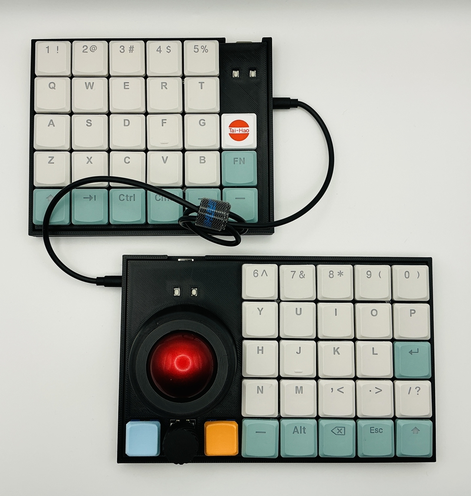
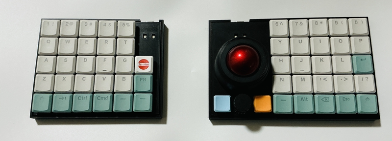
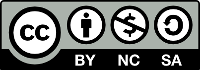

# cool655tb

## What is cool655tb?

cool655tb is 50% splite keyboards with trackball and rotary endoder.
 
cool655tb use Low profile keyswitches and keycaps.
 
cool655tb use seeed RP2040-Zero,run qmk_firmware.
 
 

## firmware

cool655tb change keymap by [vial](https://vial.rocks/)

https://github.com/telzo2000/cool655tb/tree/main/firmware

       
Note
 

https://sizu.me/m_ki/posts/vef80k39vo23

ご自身の環境でビルドする場合、参考にしてください。

 

## buildguide

https://github.com/telzo2000/cool655tb/blob/main/buildguide_for_cool655tb.md

<b>Main steps</b>

1 Soldering switchsocket.

[Switch socketハンダ付け動画](https://youtu.be/ZnbgaueMR4w?si=_JLjD--3HJJ5Pu7Q)

 

2 Soldering RP2040-Zero and pmw3610.

[RP2040-Zeroのハンダ付け動画](https://youtu.be/FV4INvCWlU0)
 

3 Pass the shaft through the bearing and attach it to the trackball case.

4 Secure the trackball case to the right top case using screws and nuts.

5 Insert the switch socket into the top plate and then the PCB.

6 Insert the bottom case.

7 Insert the screw from above and secure it with the nut on the bottom case side.

8 Connect to your PC with a USB cable and install the firmware by dragging and dropping.

 

## BOM

<b>common parts</b>
| No. | Patrs | Quantity | remarks | Suppliers | Cost |
|--|--|--|--|--|--|
|番号|名前|数|備考|調達先|参考価格（送料込）| 
|1|PCB|2||[JLCPCB](https://jlcpcb.com)|| 
|2|Top plate|2|3D Print|||
|3|Bottom case|2|3D Print|||
|4|trackball case|1|3D Print|||
|5|Diode ダイオード|56|SMD、PCBA済み|[遊舎工房](https://yushakobo.jp) [Talp Keyboard](https://talpkeyboard.net) [Daily Craft Keyboard](https://shop.dailycraft.jp)等|100個で220円程度から|
|6|Swith socket スイッチソケット|55|choc|[遊舎工房](https://yushakobo.jp) [Talp Keyboard](https://talpkeyboard.net) [Daily Craft Keyboard](https://shop.dailycraft.jp)等|10個で165円程度|
|7|RP2040-Zero|2|MCU Board|[Talp keyboard](https://shop.talpkeyboard.com/products/rp2040-zero-usb-c-compatible)[Waveshare](https://www.waveshare.com/rp2040-zero.htm)|400円ぐらい|
|8|pmw3610|1|trackball senser|[Talp Keyboard](https://talpkeyboard.net)|800円程度|
|9|Rotaly encoder|1|EC12|[遊舎工房](https://yushakobo.jp)|330円程度|
|10|Screw ネジ|11|なべこねじM2 6mm|[遊舎工房](https://shop.yushakobo.jp/products/a0800s2?variant=37665432535201)|50本880円
|11|Nut ナット|11|M2ネジに付属していることが多い|[ヒロスギネット](https://www.hirosugi-net.co.jp/shop/c/c221010/)|1個26円|
|12|Keycap キーキャップ|55|ロープロが最適|[遊舎工房](https://yushakobo.jp) [Talp Keyboard](https://talpkeyboard.net) [Daily Craft Keyboard](https://shop.dailycraft.jp)||
|13|Trackball トラックボール|1|34mm|[amazon](https://www.amazon.co.jp/PERIPRO-303-PERIMICE-517-720またはロジクール-エレコムのトラックボールマウスと互換性有り-【正規保証品】（レッド）/dp/B071NX7Y2J/ref=sr_1_1_sspa?crid=IC3QEQRDBP3F&dib=eyJ2IjoiMSJ9.d6fCtVeEHLngDEVxrhAsftG0cvpMEhX7toISVtjPRuow_pdnyK_qS7Sr-OdnjxKjS0utf-U2A91lxN9IaaBo2wLZmUa5ntpC2JlnlmonCgWoooqzbPn_VFnFI71uXq4jt7-6zgQPu4kMmdK56tGzxy6ehdaP1PVSks5lj2x6JFaSH_3rRZK9HLafnT2oGWvwTC5TVljVbjO6RVQ5dfLZDf5hnnUQNlKSrjtbp-uhKcl57NVqvIYeIVozYQw-l1KbxYvEGnFgGVVwn0fxrHBFd5SPKzRQ8yL3OQwnaQiPeos.xlG2c8T5qp-2VdRknKGMeXJ4AdiZjQWiCjGU80atfX8&dib_tag=se&keywords=トラックボール%2B34mm&qid=1771664430&sprefix=34mm%2Caps%2C206&sr=8-1-spons&ufe=app_do%3Aamzn1.fos.d8e7ee72-073f-4b97-8ec0-59c18d6dfebe&sp_csd=d2lkZ2V0TmFtZT1zcF9hdGY&th=1)||
|14|Bearing ベアリング|3|外径5mm、内径2mm、幅2.5mm|[amazon](https://www.amazon.co.jp/dp/B0CV7XLDYP?ref=ppx_yo2ov_dt_b_fed_asin_title&th=1)||
|15|Shaft シャフト（軸）|3|径2mm、｜長さ6mm|[amazon](https://www.amazon.co.jp/dp/B0FNMC8BSD?ref=ppx_yo2ov_dt_b_fed_asin_title)|| 
|16|TRRS Jack|2||[遊舎工房](https://shop.yushakobo.jp/products/a0800tr-01-1?_pos=1&_sid=9ea2ad868&_ss=r) [Talp keyboard](https://shop.talpkeyboard.com/products/35mm-4-trrs-vonnector-2pcs)|１個55円程度|
|17|34mm球|1|34mm|[Amazon](https://www.amazon.co.jp/PERIPRO-303-PERIMICE-517-720またはロジクール-エレコムのトラックボールマウスと互換性有り-【正規保証品】（レッド）/dp/B071NX7Y2J/ref=sr_1_1_sspa?crid=G7RYH7YYHNRP&dib=eyJ2IjoiMSJ9.jgqTjHy0RZ1izQVKDuChyAqAOj-PnW-oVjwV6jFNHE0w_pdnyK_qS7Sr-OdnjxKjS0utf-U2A91lxN9IaaBo2wLZmUa5ntpC2JlnlmonCgUBlKSLRyNiGOOZ_n2ahJAmRoAV5cXGW3pjX66ze7mHQoMuzV3f3SY0Sh_g8wbF8IDh8qkSoD3OgI-Mn-nW-dM9_WjvOdRGQLOf7f9h2wblOc7zdKYJln4iJSGJxoVQdkL8b0H1gIR3DFffMoXKIUfpwluk-YXzVp1MbKyOfWolVEfMrELG2cHYzalI50ulHKU.YOUM2sygcJJXeuQO_LqCqQmzaxu7KyOsB3r5KPIlm_g&dib_tag=se&keywords=トラックボール%2B34mm&qid=1773040410&sprefix=34mm%2Caps%2C255&sr=8-1-spons&ufe=app_do%3Aamzn1.fos.d8e7ee72-073f-4b97-8ec0-59c18d6dfebe&sp_csd=d2lkZ2V0TmFtZT1zcF9hdGY&th=1)|1500円位|

 

In addition, USB cable, etc. are required.
 
この他に、TRRSケーブルやUSBケーブル等が必要です。
 

 

# license

[CC BY-NC-SA](https://creativecommons.org/licenses/by-nc-sa/4.0/deed.ja)

