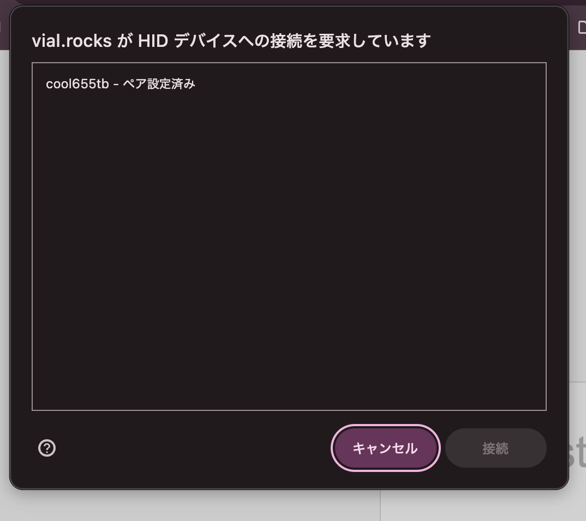
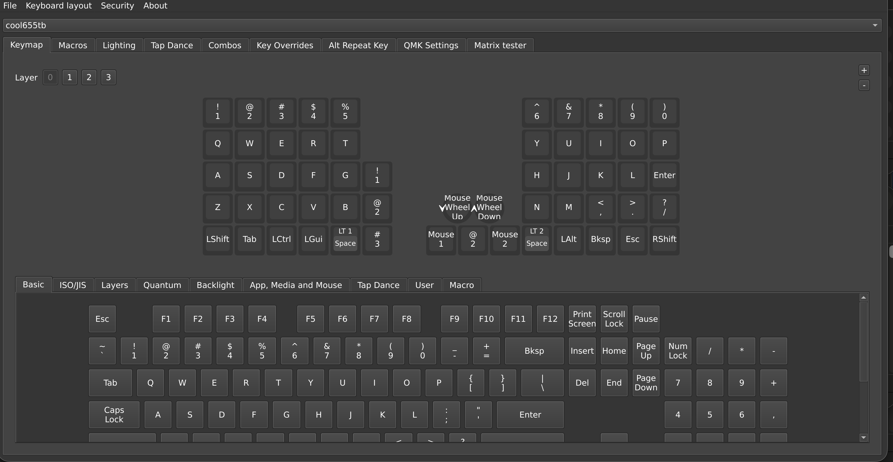
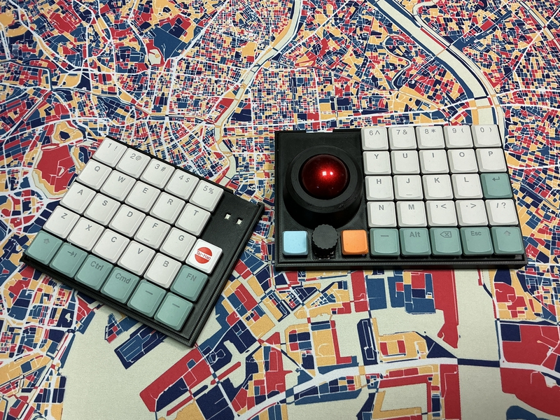

# cool655tb　ビルドガイド

## 必要な道具や準備について

[この記事](https://www.marutsu.co.jp/select/list/detail.php?id=193&srsltid=AfmBOooJYokA02APzOAhn30oi6CGrcOQctRUYAoyg4k9sK818cjgPTxS)が参考になります。

## 1　部品の確認

BOM Listを参考にして、部品に不足がないか確認ください。
 
PCBの右側（大きい方）、左側（小さい方）があるか、確認してください。
 
「cool655tb」とPCBに印刷されている面を裏面としてください。
 

## 2 スイッチソケットのはんだ付け

PCB右側の裏面が上に向くように置いてください。
 
スッチソケットを32ヶ所に置いて、はんだ付けをします。
 
次の動画を参考にしてください。

PCB右側が終わったら、PCB左側の作業をします。
 
PCB左側の裏面が上に向くように置いてください。
 
スイッチソケットを33ヶ所において、はんだ付けをします。
 

## 3 RP2040-Zeroのはんだ付け

PCB右側の裏面に上が向くように置いてください。
 
RP2040-Zeroのボタンが付いている面が下に向くように配置してください。
 
はんだ付けをします。
 
次の動画を参考にしてください。

https://youtu.be/FV4INvCWlU0

PCB右側が終わったら、PCB左側の作業をします。
 
PCB左側の裏面に上が向くように置いてください。
 
RP2040-Zeroのボタンが付いている面が下に向くように配置してください。
 
はんだ付けをします。
 

## 4 TRRSジャックのはんだ付け

PCB右側の裏面が上に向くように置いてください。
 
TRRSジャックを上から差し込んでください。
 
マスキングテープなどで仮固定をしてください。
 
PCB右側の裏面が下に向くように置いてください。
 
TRRSジャックのピンがPCBがから出ている部分をはんだ付けしてください。
 
次の動画を参考にしてください。

https://youtu.be/3gEbExaOAv4

PCB右側が終わったら、PCB左側の作業をします。
 
PCB左側の裏面が上に向くように置いてください。
 
TRRSジャックを上から差し込んでください。
 
マスキングテープなどで仮固定をしてください。
 
PCB左側の裏面が下に向くように置いてください。
 
TRRSジャックのピンがPCBがから出ている部分をはんだ付けしてください。
 

## 5 PWM3610のはんだ付け

もし、PWM3610にアクリルレンズが付いていたら、最初に外して保管してください。
 
PWM3610は左右でピンの数が違います。差し込む際、ピンの数や配置でミスを防げます。
 
PCB右側の裏面が上に向くように置いてください。
 
上からPWM3610のレンズ部分（シールで保護されています）が下に向くようにして、差し込んでください。
 
マスキングテープなどで仮固定をしてください。
 
PCB右側の裏面が下に向くように置いてください。
 
PWM3610のピンをはんだ付けしてください。ただし、PWM3610は高熱によって破損の可能性があります。
 
ハンダゴテを１つのピンに２秒以上、当て続けないように注意してはんだ付けしてください。
 
 
レンズ部分の保護シールを外してください。ピンセットで行うと容易です。
 
次に、保管しておいたアクリルレンズをPWM3610にはめてください。
 
アクリルレンズをマスキングテープなどで仮固定してください。
 
PCB右側の裏面が下に向くように置いてください。
 
PWM3610にはみ出たアクリルレンズの足を、温めたハンダゴテで溶かしてください。これによって、アクリルれずが固定されます。
 
次の動画を参考にして草ださい。

 

## 6 ロータリーエンコーダのはんだ付け

PCB右側の裏面を下に向けてください。
 
ロータリーエンコーダを上からPCBに差し込んでください。
 
PCB右側の裏面を上に向けてください。
 
裏面からはんだ付けをしてください。
 

## 7 ベアリングの設置

トラックボールケースの下側を用意します。
 
ベアリングにシャフトを通したら、トラックボールケースの下側の内部に置いてください。
 
３ヶ所にベアリングを置くことができれば、終了です。
 

## 8 ベアリングケースの固定

トラックボールの下側と右側スイッチプレートをネジとナットで固定します。
 
トラックボールの下側からネジを差し込んで、スイッチプレートの反対側をナットで固定します。
 
３ヶ所をネジで固定できれば、終了です。
 

## 9 ケースの固定

右側のスイッチプレート、PCB右側、右側のボトムケースの順で重ねてください。
 
スイッチプレート側からネジを差し込んで、ボトムケース側のナットで固定してください。
 
ネジは４ヶ所あります。
 
 
左側のスイッチプレート、PCB左側、左側のボトムケースの順で重ねてください。
 
スイッチプレート側からネジを差し込んで、ボトムケース側のナットで固定してください。
 
ネジは４ヶ所あります。
 

## 10 キースイッチの差し込み

お好みのキースイッチ（choc V2推奨）を左右合わせて55ヶ所に差し込んでください。
 
差し込む際に、キースッチの足が曲がってしまうミスが起きる可能性があります。
 
後に、動作確認で、一部のキーが反応しないときは、キースッチの足が曲がっていて、きちんと差し込まれていないかどうか、確認してください。
 

## 11 トラックボールの配置

34mm球を用意してください。
 
キーボード右側につけたトラックボール下側に34mm球を置いてください。
 
上からトラックボールの上側を被せて、軽く回すと、固定されます。
 

## 14 キーキャップを装着

お好みのキーキャップ（ロープロファイル用を推奨）を装着してください。
 
[Taihao Thins Keycap set](https://shop.talpkeyboard.com/collections/tht-keycapset)ならば、困ることは少ないと思います。
 

## 13 Firmwareをインストール

https://github.com/telzo2000/cool655tb/tree/main/firmware

上記のリポジトリにある「cool655tb_vial.uf2」ファイルを用意してください。
 
PCとキーボード左側にあるRP2040-ZeroのUSB挿入口を、USBケーブルで繋いでください。
 
RP2040-ZeroのBootボタン、Resetボタンの順で押してください。
 
もし、よくわからないときは、キーボード左側の四角窓の左側ボタンを押し続けながら、右側のボタンを１回押してください。
 
PC上にRP2040-Zeroがマウントされます。
 
そこに、用意したファイルをドラッグ&ドロップしてください。
 
これで左側にFirmwareがインストールされました。
 
次に、右側でも同じことをします。
 

## 14 TRRSケーブルで繋いで、動作確認

<b>ミスが起きないよう、キーボードに繋いであるUSBケーブルを抜きましょう。</B>
 
 
キーボードの左右をTRRSケーブルで繋ぎます。ケーブルがしっかりと差し込んでください。
 
USBケーブルをキーボードの右側にあるRP2040-Zeroに差し込んでください。USBケーブルの反対側はPCに差し込んでください。
 

[Vial](https://vial.rocks/)にアクセしてください。

「Start Vial」をクリックしてください。

「cool655tb」を選んでから、「接続」をクリックしてください。

ここで、キーマップ編集ができます。

 

## 15 ゴム足をつけて完成

ケース底面に丸型の窪みがあります。
 
そこに、滑り止めのゴム足をつけてください。
 

お疲れ様でした。

 
<b>
新しいキーボードで、人生をエンジョイしてください。
</b>

